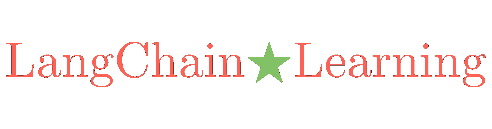

## 本项目主要通过阅读源码，系统记录langchain的所有知识点
  

langchain是一个用于开发以大模型作为底层能力支持的应用的框架，你如果要开发一个基于大模型的的应用，那么选择langchain会方便很多。 因为它为大模型应用产品提供了全生命周期管理方案。
1. 应用的全生命周期管理
   2. 应用开发：用langchain提供的组件进行项目开发，或者用langGraph提供有状态的应用开发
   3. 项目监控：用langsmith提供实时的调试、监控和评估，为项目的迭代提供依据
   4. 项目部署：使用LangServe或者langchain cloud部署项目，对外暴露REST API风格接口

上面所讲的langchain其实是一整个生态，包括了langchain模块、langsmith模块、langGraph模块、LangServe模块，以及langchain cloud，每个模块都提供了不一样的能力
而langchain是我们从无到有开发产品时要用到的开发框架，

本项目将通过源码阅读的形式，来做一些内容的记录

## 目录
- 第1章: langchain 简介
  - [1.1 runnable底层原理](docs/runnable底层原理.md)
- 第2章: langchain 中的prompt
  - [2.1 prompt第一讲-prompt科普](docs/prompt第一讲-prompt科普.md)
  - [2.2 prompt第二讲-langchain实现中英翻译助手](docs/prompt第二讲-langchain实现中英翻译助手.md)
    - [2.2.1 prompt第三讲-PromptTemplate](docs/prompt第三讲-PromptTemplate.md)
  - [2.3 prompt第四讲-fewshot](docs/prompt第四讲-fewshot.md)
    - [2.3.1 prompt第五讲-fewshot-selector](docs/prompt第五讲-fewshot-selector.md)

  