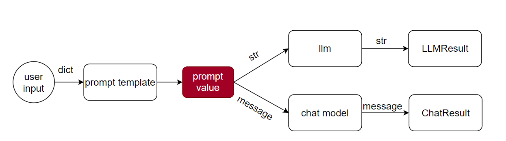

## prompt模板 (prompt template)
开篇我介绍了在llm中，通常输入的那个字符串会被我们称之为prompt，下面就是一个中英文翻译助手的prompt例子
```shell
你是一个翻译助手，你擅长将中文翻译为英文，请将我发送给你的question的内容翻译为英文，不要返回无关的内容，只需返回最终翻译结果，下面的history examples中提供了一些具体的案例，为你提供一些参考：

## history examples:
question:美丽->answer:beautiful;
question:男孩->answer:boy;
question:男人->answer:man;
question:456->answer:four hundred and fifty-six;
question:1->answer:one;
question:34->answer:thirty-four;

## user true task:
question：123->answer：
```
也就是说不管怎样，你最终给模型一定是上面这一大串东西，你如果要翻译“扑街”,只是把最底部的question替换掉
```shell
你是一个翻译助手，你擅长将中文翻译为英文，请将我发送给你的question的内容翻译为英文，不要返回无关的内容，只需返回最终翻译结果，下面的history examples中提供了一些具体的案例，为你提供一些参考：

## history examples:
question:美丽->answer:beautiful;
question:男孩->answer:boy;
question:男人->answer:man;
question:456->answer:four hundred and fifty-six;
question:1->answer:one;
question:34->answer:thirty-four;

## user true task:
question：123->answer：
```
但是如果你真的要开发一个中英文翻译助手给用户使用的时候，不可能每一次都让用户完整重写这一大堆的东西吧，我们希望的是用户只输入他想要翻译的中文，我们在后台把他输入的内容
根据设定的模板填入，最终将填充后的内容发送给llm
```shell
你是一个翻译助手，你擅长将中文翻译为英文，请将我发送给你的question的内容翻译为英文，不要返回无关的内容，只需返回最终翻译结果，下面的history examples中提供了一些具体的案例，为你提供一些参考：

## history examples:
question:美丽->answer:beautiful;
question:男孩->answer:boy;
question:男人->answer:man;
question:456->answer:four hundred and fifty-six;
question:1->answer:one;
question:34->answer:thirty-four;

## user true task:
question：{user_input_words}->answer：
```
用户没输入时，我们定义好的这个模板，就叫做**prompt模板（prompt template）**,当用户输入内容后这个内容会替换掉模板中的user_input_words，替换后的完整内容就是一个
**prompt**，这个prompt就是要传入到llm的字符串。

**总结：prompt template就是具有一定变量（1个或多个）的字符串，这些变量是运行时用户输入的。用户输入后构成的完整字符串才被叫做prompt**

## langchain 中的prompt模板 (prompt template)
在langchain中，提供了定义prompt template的能力，而prompt template接受用户内容后生产出来的内容叫做prompt value，这里的prompt value为什么不直接叫做prompt，是因为
它和llm需要的prompt（字符串）还有点区别，之所以有区别，是因为在langchain设计了两种模型大类，一种是llm，另一种是chatmodel，llm的输入是接收字符串的，这也就是我前面说的prompt了，
而chatmodel接受的是message的，所以二者所需要的数据格式是不一样的。langchain为了兼容这两种模型大类，langchian的prompt template生产出的内容是prompt value，而prompt value好
处就是既可以转为llm需要的字符串形式，也可以转为chatmodel需要的message形式，这就很方便了。 

**注：上面虽然说chatmodel需要的是message类型的数据，但是底层chatmodel调用的也是llm，自然输入的内容最终也是会转成字符串的，这么设计也是有原因的，后面会一一讲出**

## langchain实现中英翻译助手
下面就用langchain实现中英翻译助手
```python
# -*- coding: utf-8 -*-
"""
@Time ： 2024/7/8 9:44
@Auth ： leon
"""
from langchain_core.prompts import PromptTemplate
# 1. prompt模板定义
prompt_template = PromptTemplate.from_template("""
你是一个翻译助手，你擅长将中文翻译为英文，请将我发送给你的question的内容翻译为英文，不要返回无关的内容，只需返回最终翻译结果，下面的history examples中提供了一些具体的案例，为你提供一些参考：

## history examples:
question:美丽->answer:beautiful;
question:男孩->answer:boy;
question:男人->answer:man;
question:456->answer:four hundred and fifty-six;
question:1->answer:one;
question:34->answer:thirty-four;

## user true task:
question：{user_input_words}->answer：
""")

# 2. llm定义
from langchain_community.llms import Tongyi
from pydantic_settings import BaseSettings,SettingsConfigDict

"""
2,1 获取千问的key
我这么写的原因是因为方便我上传项目到github的同时，不暴露我的key，所以我把可以key保存到了最外部的一个.env文件中
这样我每一次同步到github的时候就不会把key也推出去，你们测试的时候，可以直接写成
qwen_key="sk-cc2209cec48c4bc966fb4acda169e",这样省事。
"""
class ModelConfig(BaseSettings):
    model_config = SettingsConfigDict(env_file="../../.env",env_file_encoding="utf-8")
    qwen_key:str
    deepseek_key:str
    deepseek_base_url:str

model_config = ModelConfig()
qwen_key = model_config.qwen_key
# 1. 读取配置信息,获取模型key
llm = Tongyi(dashscope_api_key=qwen_key)


while(True):
    user_input_words = input("请输入需要翻译的内容：")
    if user_input_words.lower() =="quit":
        break
    else:
        prompt = prompt_template.invoke({"user_input_words":user_input_words})
        print(llm.invoke(prompt))
```

**讲解：**
1. 调用PromptTemplate.from_template产生一个prompt 模板（这个模板只需要定义一次，也就是说prompt 模板只有一个）
2. 调用Tongyi得到一个llm模型，这里的key需要你去阿里官网申请
3. 循环接收用户的输入，每输入一次，就会根据输入内容填充到模板中，得到一个具体的prompt，然后将这个prompt传递给llm（也就是说prompt是不唯一，每次用户输入后填充到模板中得到的prompt总是不一样的）

**总结**：
1. prompt模板（prompt template）只有一个，只需定义一次；
2. prompt是多个的，用户每输入一次，输入变量填充到prompt模板中得到的就是一个新的prompt
