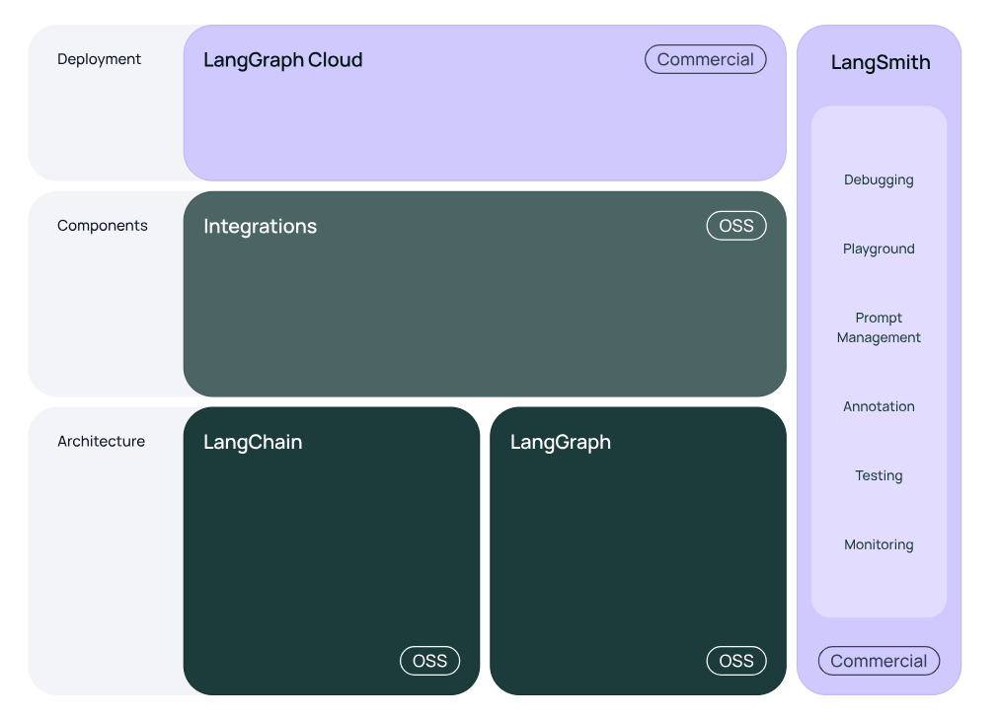
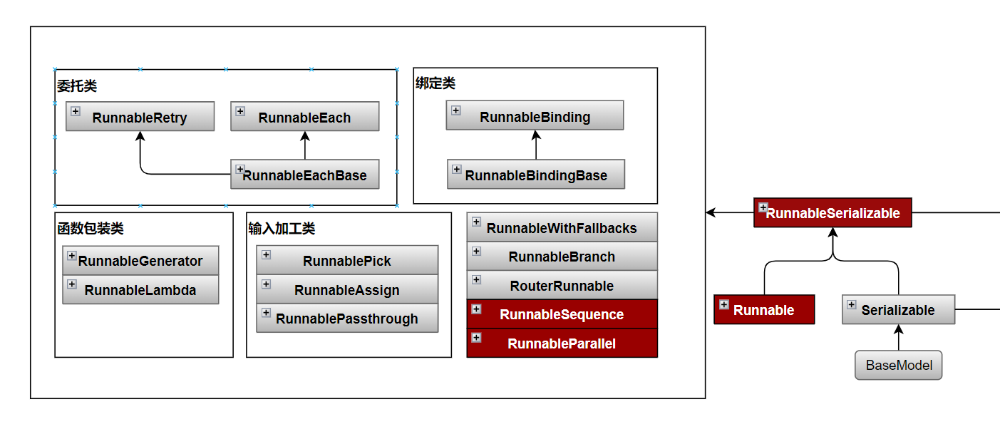

# langchain
## langchain生态介绍

langchain是一个用于开发以大模型作为底层能力支持的应用的框架，你如果要开发一个基于大模型的的应用，那么选择langchain会方便很多。 因为它为大模型应用产品提供了全生命周期管理方案。
1. 应用的全生命周期管理
   2. 应用开发：用langchain提供的组件进行项目开发，或者用langGraph提供有状态的应用开发
   3. 项目监控：用langsmith提供实时的调试、监控和评估，为项目的迭代提供依据
   4. 项目部署：使用LangServe或者langchain cloud部署项目，对外暴露REST API风格接口

上面所讲的langchain其实是一整个生态，包括了langchain模块、langsmith模块、langGraph模块、LangServe模块，以及langchain cloud，每个模块都提供了不一样的能力
而langchain是我们从无到有开发产品时要用到的开发框架，那下面就具体来说langchain模块

## langchain
langchain是提供大模型应用开发的开发框架，其主要有两个大块组成
1. langchain-core : langchain底层的抽象框架，以及为lagnchain自家标榜的LCEL表达语言提供支持
2. langchian-community：第三方的集成，其中诸如openai、google、阿里等等第三方公司的能力的集成，这个能力包括大模型能力、搜索能力、embedding能力等等，不局限于大模型的能力
还有一个需要注意的是，有些第三方的支持会被独立的抽取出来，提供更轻量化的支持，比如langchain-openai，langchain-anthropic

本质上来说，langchian-community只是继承了langchain-core，实现了底层定义的抽象，所以langchian的核心的核心都在langchain-core，
langchain-core既为第三方的扩展提供了标准，也为langchain自身设计奠定了基调，那langchain的设计基调是什么呢？是LCEL

## LCEL
LCEL是langchain所标榜的一个设计原则，它以一种以声明式的形式将langchain的各个组件链接起来，这里讲一下声明式，声明式意思就是说你只用关心输入和输出
关于模块本身的实现细节，并不需要你去关心，举个例子哈，比如在langchain中的llm，它有一个方法是invoke，它接受一个字符串，返回一个字符串，用户在使用的过程中
根本不需要知道太多的细节，只需要知道invoke是输入一个字符串然后传给llm得到一个字符串就可以了。同时这样还有一个好处，在langchain中设计了很多的组件，
只要一个组件的输出格式满足另一个组件的输入，就可以把它串行起来组成一个runnableSequence。而这些关于LCEL的底层支持都来自于runnable，runnable是一个类，几乎在langchain中的所有组件都继承了这个类。

## runnable
runnable是langchain的一基类，几乎所有的核心组件都是runnable的子类，包括聊天模型、LLM、输出解析器、检索器、提示模板等，甚至你组成的chain也是
runnable的子类：RunnableSequence或者是RunnableParalle，总之，几乎所有的组件都是runnable的子类。

而runnable本身定义了一些标准的接口，用于子类去实现，其中比较重要的几个标准接口包括
invoke：提供单个输入，得到单个输出
batch：提供多个输入，得到多个输出
stream：提供单个输入，得到流式输出

ainvoke:invoke的异步
abatch：batch的异步
astream：stream的异步

下面稍微丢一小部分，底层的runnable的框架图，这些都是lcel的基石


### runnable基础能力介绍
#### invoke
作用： 传递单个输入得到单个输出

步骤：
1. 子类去实现
#### batch
作用： 传递多个输入得到多个输出

步骤：
 1. 校验配置文件
    2. 如果没有传入配置文件，则初始化最小4个参数，
    ```python
            empty = RunnableConfig(
            tags=[],
            metadata={},
            callbacks=None,
            recursion_limit=25,)
    ```

    3. 如果输入是多个，则配置文件要copy到同样长度，得到一个配置文件列表
    4. 配置文集列表中只有第一个要设置run_id,其他的需要删除，便于trace追踪
    
2. 创建一个线程池，并行调用invoke
#### stream
作用：
1. 流式输出

步骤：
1. yield输出invoke结果
#### ainvoke
作用： 传递单个单个输入，异步的得到单个输出

步骤：   
1. 创建一个事件循环；
2. 使用一个默认的执行器，通常就是一个线程池，来执行同步的invoke方法
3. 将执行器交给事件循环，实现异步功能
注意：如果子类不重写，其实本质只要你的runnable支持invoke，就会支持ainvoke
#### abatch
作用： 传递多个输入,异步的得到多个输出

步骤：
 1. 校验配置文件
    2. 如果没有传入配置文件，则初始化最小4个参数，
            empty = RunnableConfig(
            tags=[],
            metadata={},
            callbacks=None,
            recursion_limit=25,)
    3. 如果输入是多个，则配置文件要copy到同样长度，得到一个配置文件列表
    4. 配置文集列表中只有第一个要设置run_id,其他的需要删除，便于trace追踪
    
2. 创建一个事件循环，并行根据每一个输入调用ainvoke,(有最大输入调用次数限制：max_concurrency)
#### astream
作用：
1. 异步流式输出

步骤：
1. yield输出ainvoke结果

#### __or__、__ror__
作用： 重写|符号，将两个runnablelike拼接成runablesequence

步骤：
1. 检查输入的对象other是否是runnablelike
   2. runnablelike包括 
   ```python
   RunnableLike = Union[
                         Runnable[Input, Output],
                         Callable[[Input], Output],
                         Callable[[Input], Awaitable[Output]],
                         Callable[[Iterator[Input]], Iterator[Output]],
                         Callable[[AsyncIterator[Input]], AsyncIterator[Output]],
                         Mapping[str, Any],
                     ]
   ``` 
   3.  如果输入对象是一个runnable，则直接返回
   4.  如果输入对象是一个异步生成器或者是一个生成器，则将输入转为RunnableGenerator返回
   5. 如果输入对象是一个可调用对象，则将输入转为一个RunnableLamabda
   6. 如果输入是一个字典，则将输入转为一个RunnableParallel
2. 将原始的runnable和转化后的输入拼接成一个新的runnableSequence

#### pipe
作用：和__or__完全相同

#### get_name
作用：获取runnable的名字

步骤：
1. name获取：
    1. 如果传入了name，则就用传入的；
    2. 如果没有传入，就用runnable初始化时复制的name
    3. 如果都没有，就用runnable的类名作为name
2. name相关属性返回：
    1. 如果传入suffix：则返回结果为suffix_name
    2. 如果没有传入name，则返回name
#### InputType  (属性)
作用：返回Runnable的input类型

步骤：
1. 直接获取此类的参数，第一个参数为输入参数，返回出入参数的类型
#### OutputType  (属性)
作用：返回Runnable的output类型

步骤：
1. 直接获取此类的返回参数
#### input_schema  (属性)
作用：获取输入的schema

步骤：
1. 获取输入schema：
    1. 如果输入类型是一个类，且是继承了BaseModel，则直接返回输入类型
    2. 否则，根据输入类型创建一个pydantic的数据模型
#### output_schema  (属性)
作用：获取输出schema

步骤：
1. 获取输出schema：
    1. 如果输出类型是一个类，且是继承了BaseModel，则直接返回输入数据类型
    2. 否则，根据输入类型创建一个pydantic的数据模型


**注意：原则上说，子类只要重写了invoke，其他的诸如ainvoke，batch，abatch等都可以使用，这是子类的最小化实现方式，特殊情况下其他的方法也会被一定程度的重写**