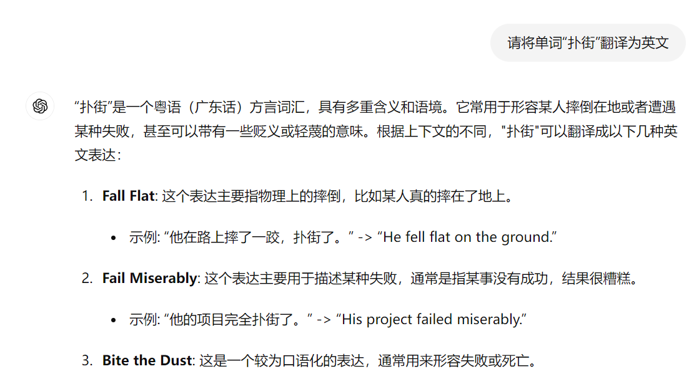
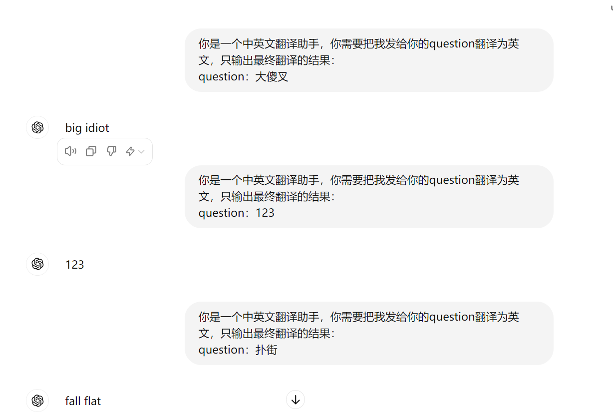
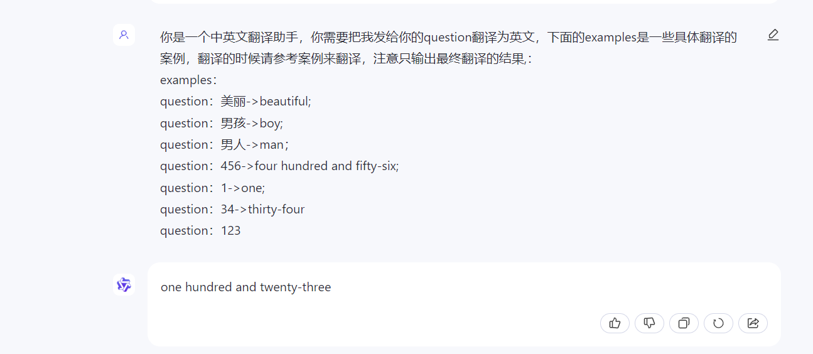
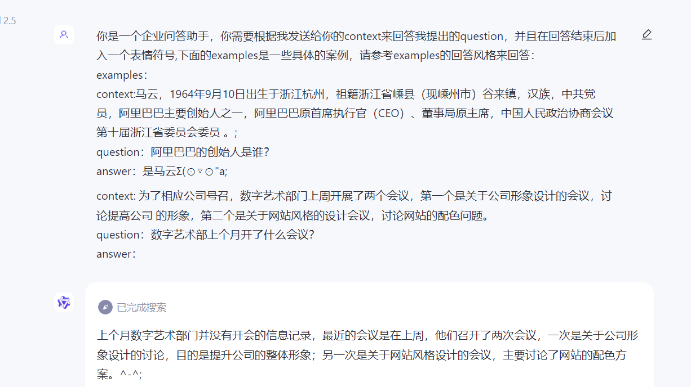

## 大模型输入要求
大模型本质上就是一个语言模型，语言模型其实就是**接受一堆的文本，得到一堆的文本**,而输入给模型的这段文本，我们通常把他称之为**prompt**
下面我们以一些具体的例子来感受一下这段文本(prompt)该如何写。
### 中英翻译助手
我现在要做一个中英文翻译任务，下面我会一步一步的写出prompt
#### 直接抛出问题
```shell
请将单词“扑街”翻译为英文
```
下面是GPT给的回答，从下面的回答中可以看出有些废话是我们不需要的，我们只需要最终答案


#### 描述+问题
```shell
你是一个中英文翻译助手，你需要把我发给你的question翻译为英文，只输出最终翻译的结果：
question：扑街
```
首先我们先看看相较于前面的prompt，我们这次不是直接描述我们想要解决的问题，而是加上了一个描述，这个描述给llm定义了一个角色，也告诉了他什么该做
什么不该做。改进之后我们看看下面的回复内容，我们发现，他就不会出现那些废话了，但是有一些问题：比如我发送123的时候，它并没有翻译，为了能够让123
也能够翻译为中文，这时候，我们再改进改进


#### 描述+案例+问题
```shell
你是一个中英文翻译助手，你需要把我发给你的question翻译为英文，下面的examples是一些具体翻译的案例，翻译的时候请参考案例来翻译，注意只输出最终翻译的结果,：
examples：
question：美丽->beautiful;
question：男孩->boy;
question：男人->man；
question：456->four hundred and fifty-six;
question：1->one;
question：34->thirty-four
question：123
```
相较于上一步，这一步的改进就是加入了一些案例，让模型知道当遇到数字的时候也需要翻译为英文，但是其实在这个案例中加入的例子并不能完全说明例子的作用，
我们完全可以在描述部分就和大模型说明：当遇到数字的时候，也需要将它翻译为中文，这样也是可以的。而例子真正能够发挥作用的地方通常是面对一些特殊的回答格式等要求上，
比如你需要模型返回一个list或者是json格式的数据的时候，这时候你给一个案例对模型来说是非常有用的。如果你不给例子，而在描述的时候说明的话，模型跑着跑着就会跑偏，
如果加入一些案例，那么就会大大加强模型的指令跟随能力。


#### 描述+案例+上下文+问题
基本上上面关于中英文翻译的问题就被解决了，下面我来再举一个具体的例子：私域企业问答助手。

假设有一个公司非常大，大到员工找资料都很费劲，这时候就需要一个助手，能够回答出员工提出的一些公司的问题。在这个案例中，有一个特殊性在于，这些答案都是来自于公司内部的文档的，
而模型生成的内容铁定是不对的，因为模型都是基于历史开放数据训练的，对于这种私域的数据它是从来没讲过的，况且模型生成的内容会有幻觉问题，如果你开发的应用是面向生产
那么最好是要避免幻觉的，基于这种种的问题考虑。所以这时候，最好的办法就是先利用某种相似度匹配算法，在公司内部文档中找到和问题相关的答案，然后将这个可能的答案以上下文的形式带回给模型，让
模型根据上下文来生成答案。
```shell
你是一个企业问答助手，你需要根据我发送给你的context来回答我提出的question，并且在回答结束后加入一个表情符号,下面的examples是一些具体的案例，请参考examples的回答风格来回答：
examples：
context:马云，1964年9月10日出生于浙江杭州，祖籍浙江省嵊县（现嵊州市）谷来镇，汉族，中共党员，阿里巴巴主要创始人之一，阿里巴巴原首席执行官（CEO）、董事局原主席，中国人民政治协商会议第十届浙江省委员会委员 。;
question：阿里巴巴的创始人是谁？
answer：是马云Σ(⊙▽⊙"a;

context: 为了相应公司号召，数字艺术部门上周开展了两个会议，第一个是关于公司形象设计的会议，讨论提高公司 的形象，第二个是关于网站风格的设计会议，讨论网站的配色问题。
question：数字艺术部上个月开了什么会议？
answer：
```
从下面的结果可以看出，它是根据context回答问题的，同时也像案例中一样，在结尾加入了一个表情，完美了。


#### prompt总结
从上面的两个例子我们可以总结一下：
1. 输入模型的就是一堆的字符串，而这这堆字符串通常我们称为prompt
2. prompt一般会有四个部分组成
   3. 描述：定义模型的角色身份，能力边界，以及一些必要的限制条件
   4. 示例：给出一些案例，加强模型指令跟随能力
   5. 上下文：和答案相关的上下文，为回答问题提供资料支持
   6. 问题：用户提出的具体问题

基本上大概就这四部分构成一个prompt，当然如果你的任务足够简单，有可能你并不需要四部分都具备，同时呢？也有可能任务很复杂，
你会设计更复杂的prompt，但是大致都是可以总结为这四个组成部分。